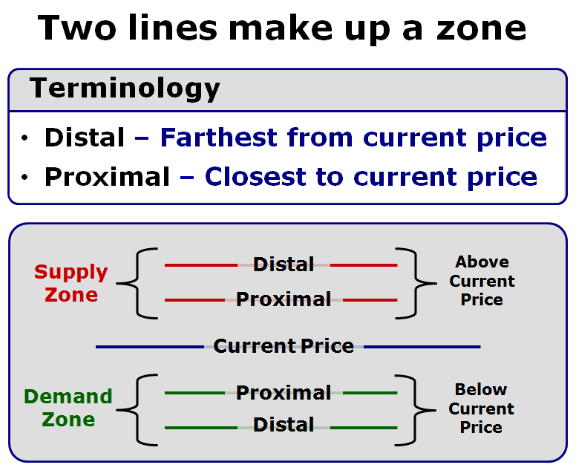

 

# btc-trading-app
BTC Trading App on Deribit Market

## Terms

1. Supply = S
2. Demand = D
3. Bullish  - Market is going up (like a bull’s horns). Biased to higher prices. Uptrend
4. Bearish - Market is going down (bear down). Biased to lower prices. Downtrend
5. SET = Stop, Entry, Target. Every trade needs to be SET.
6. Entry = The act of opening a position in a market.
7. Exit = The act of closing a position in a market. Can be for a profit or a loss.
8. Stop = Stop Loss is an order to exit a position for a predefined loss; also known as a Protective Stop Loss
9. Target = Profit target is an order to exit a position for a predefined gain
10. Risk = difference between entry and stop loss.
11. Reward = difference between entry and target.
    1. Minimum amount of reward to risk ratio (i.e 3-1)
12. Long Position = want the price to go up. a position bought now with the intent to sell later at a higher price.
13. Short Position =  a position that is sold now with the intent to buy later at a lower price. Futures & Forex do not have “shorting” restrictions.
14. Reward-to-Risk Ratio = 2.00/.50 = 4. This is a 4:1 PR or a “4R” trade.
    1. Don’t want to take anything less than a 3:1 ratio (as a beginner)
15. 
16. 
17. 

## Charting

1. Ticker Symbol - The item that we are charting
2. Time Frame - the amount of time each candle represents in a chart
3. Open/high/low/close volume
    1. Open - The first trade in the trading day
    2. High - The highest traded price for that day
    3. Low - Lowest traded price for that day
    4. Volume - how many shares were traded for that day
4. Date/Time = Scale at the bottom of a chart
5. Current Price = Right hand side of chart - always the most recent trade
6. Hourly Income Trader: 60 min, 15 min, & 5 min charts
7. Daily Income Trader: Daily, 60 min & 15 min charts
8. Weekly Income Trader: Weekly, Daily & 240 /60 min charts
9. Monthly Income Trader: Monthly, Weekly, & Daily charts
10. 
    1. Body = Open - Close
    2. Range = High - Low
    3. Boring Candles: Imply that supply and demand is in balance and that orders are potentially by accumulated by the institutions
       1. Body &lt;= 50% of the range
    4. Exciting Candles: The greatest imbalance between supply and Demand is found at the origin of a series of Exciting Candles. Institutions are not chasing price, therefore there is less institutional activity within the Exciting Candle bodies.
       1. Body > 50% of the range
    5. Our Core Strategy will use Supply and Demand Levels made of Boring Candles followed by a series of Exciting Candles

## Supply & Demand

1. 
2. Two Core Setups
    1. Drop Base Rally = DBR
        1. Action = Buy Retracement
    2. Rally Base Drop = RBD
        2. Action = Sell Retracement
    3. 
    4. 

## Supply & Demand Zones

1. Zone = a region on a chart, marked by two horizontal lines around the price level where Supply and Demand are out of balance
    1. 2 types of zones
       1. Supply Zone
       2. Demand Zone
2. 
3. 
4. 
5. Proximal Line can be drawn in 3 areas
   1. Top of the candle stick
   2. to of candle body
   3. Bottom of Candle body
6. Distal Line must be drawn at the bottom of the candle stick
7. 
8. Steps to Draw Supply & Demand Zones
   1. 
   2. 
   3. 

## Multiple Time Frames

1. A minimum of 3 time frames when planning trades
    1. Higher Time Frame (HTF) - used to assess the Curve
    2. Intermediate time Frame (ITF) - used to assess the trend
    3. Lower Time Frame (LTF) - Used to identify Supply and Demand to SET our trade
    4. Optional - Refining Time Frame (RTF) - used to refine Proximal and Distal
2. Curve Analysis
    1. helps us to know when to be in  Bullish or Bearish mode.
    2. Combined with the Odds Enhancers  Scoring Methodology dictates smarter action to be taken (Buying or Selling) and only then we focus on Supply and Demand Zones to time the Entries and Exits of our trades.
    3. Want to be looking for “Fresh” levels (see terminology)
    4. Basic Curve Analysis - understanding how High or Low our entries are. Or are we in a state of Equilibrium.
    5. 

3. Trend Analysis
    1. Helps us know which is the main direction in which a market is moving
    2. Trend is simply Price movement traveling from Larger time Frame Supply to Larger Time Frame Demand or vice versa 
    3. Trend is how we get paid as a trader since this Price movement happens after a good Entry into a Market
    4. Trends are assessed by using an Intermediate Time Frame and can be Up, Down or Sideways
    5. Joining the Trend and following it is another valid possibility as long as our Entries are located favorably in the Curve
    6. 
    7. 
    8. 
    9. The really key question is what is the Trend going to be next?
    10. We call this Anticipatory Trend Analysis
    11. Two Ways of Assessing the Trend of Price:
        1. Conventional Trend Analysis
            1. Observing Price Action and identifying Pivots High and Low
            2. Anticipatory Trend Analysis -Covered in XLT- Extended Learning Track
4. Multiple Time Frame Analysis
   1. 
   2. 
   3. 
   4. 
 
##  Entry Types

1. There are 3 Basic Entry Types
   1. Limit Entry
      1. A Sell limit order is placed before price reaches the proximal line, with a Buy stop order just above the Distal line
      2. A Buy limit order is placed before price reaches the proximal line, with a Sell stop order just below the Distal line
      3. Zone Entry
         1. A Sell limit or market order is placed when price is anywhere inside the supply zone
         2. A Buy limit or market order is placed when price is anywhere inside the demand zone
         3. Many platforms won’t be able to set this up automatically 
            1. You can set up contingent orders to get around this
      4. Confirmation Entry
         1. When price rallies into the Supply Zone, reverses, and crosses below the proximal line, Sell Short
         2. When price drops into the Demand Zone, reverses, and crosses above the proximal line, Buy
      5. 

## The Exit

1. Make sure you have a clear and planned Target and Stop Loss Exit
2. Make sure your Target represents at least a 3:1 Reward to Risk ratio
3. Exit Before the competitive buying and selling begins (just before opposing Supply and Demand Levels)
4. We will manage the Trade by moving our Stop Loss Exit Order (only toward the direction of profitability)
5. The Trail Stop
    1. 
    2. 
6. Preset Rules
    1. Preset Plan #1
       1. Once price reaches 2:1, move stop to breakeven. This reduces risk but also may reduce the probability of meeting profit target. Once price reaches 3:1 take profits. This trade management strategy can lead to higher profits.
    2. Preset Plan #2
       2. Once a price reaches 1:1, move stop to breakeven. This reduces risk quickly but also may reduce probability of meeting profit target. Once price reaches 2:1, take profit. This trade management strategy can lead to higher winning percentages.
    3. You can experiment with the numbers and create any trade management strategy you like. One will lead to higher winning percentage (less important) and another will lead to higher profits (more important). The key to making it work is a proper entry and sticking to the strategy.

## Odds Enhancers

1. Definition:
    1.  A scoring system that objectively measures the quality of a trade setup based on Supply and Demand: Level Structure, Curve Location and Key Conditions
    2. The more “Odds Enhancers” used the better the understanding of that trade setup
    3. You will decide which is the minimum score to be accepted to enter a trade based on your level of risk aversion and your purpose of trading
    4. The higher the score the better the opportunity, the lower the score the weaker the opportunity.
2. There are 5 types of Odds Enhancers:
   1. Level Structure
      1. How the level “looks”
   2. Curve Location
      1. Where the level is.
   3. Key Conditions
      1. Environmental circumstances
   4. Asset-Class Specific
      1. Affecting different Asset Classes differently
   5. All Asset Classes
      1. Affecting Asset Classes the same way
3. Level Structure (LTF)
    1. 
    2. 
        1. Best = 2: 60 degree or higher move
        2. Good = 1: 45-60 degree move
        3. Poor = 0: less than 45 degree move
    3. 
        1. Best = 2: 3 or less candles in the base of the level
        2. Good = 1: 4-6 candles in the base of the level
        3. Poor = 0: more than 6 candles in the base of the level
4. Curve Location (HTF)
    1. Profit Zone
        1. 
5. Proper Curve Location (HTF) and proper Structure (LTF) of a Supply and Demand Zone is Key

## Order Types

1. 4 Main Order Types
    1. Market (more important)
    2. Limit (more important)
    3. Stop Market
    4. Stop Limit
2. Market Order - used as our stop loss
    1. 
3. Limit Order
    1. 
4. Stop Market
    1. 
5. Stop Limit
    1. 
6. 
7. Primarily we will use Limit orders for Entry, Limit orders for Target, Stop Market Orders for Losses

## Bracket Orders

1. Bracket order is an order that has an entry, stop  & exit set all at once
2. 

## Risk Management

## Position Sizing

1. Properly determining position size is KEY in managing risk
2. Every asset will have a specific way on how to calculate the proper Position Size, but theres is a rule that applies to all of them
3. The 2% RULE
4. Our position size has to be dependent on the account size in a way where we are willing to risk more once the account is growing and we are willing to risk less if the account is diminishing….
5. We use a percentage of the Account Size to achieve that goal
6. Risking less than 2% per trade is definitely OK, but make sure you never exceed the 2% mark.
7. How many shares to take in a position = Risk amount / amount of risk per trade = Shares

